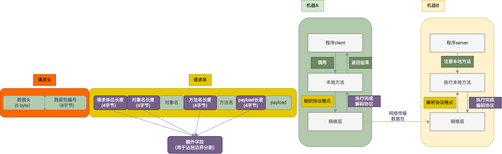
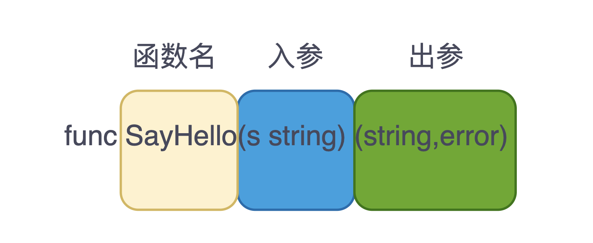
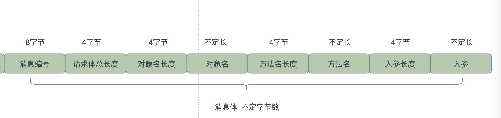
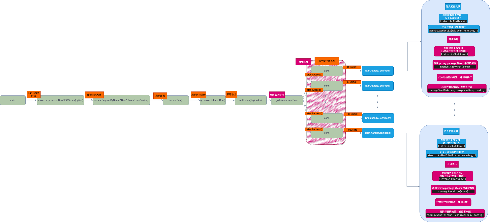
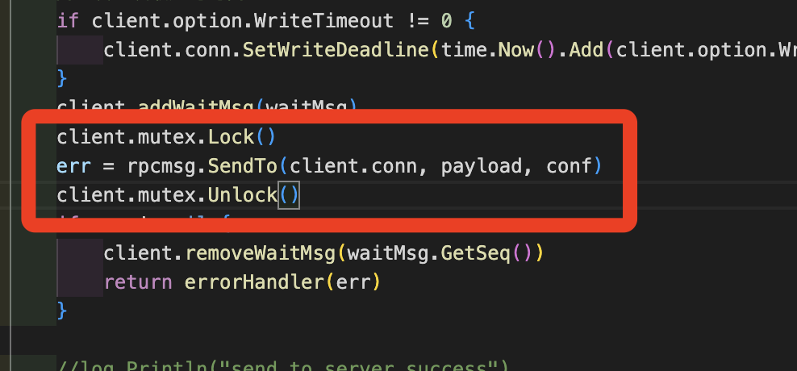
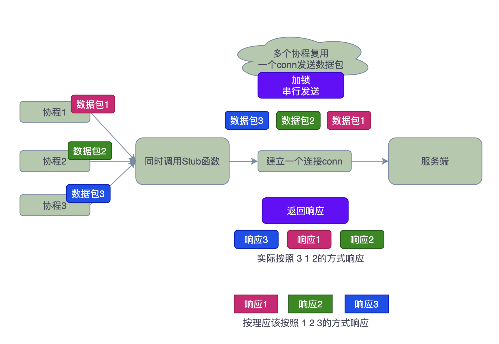

# 适合新手的简单Golang项目：实现自己的RPC框架

设计并实现了自己的`easyrpc`供大家了解和学习，源代码已托管至Github: https://github.com/gofish2020/easyrpc

通过本项目你可以学到什么？

- 服务优雅停止
- 沾包的处理
- 网络通信协议格式制定
- 客户端网络连接复用（并发调用）
- 序列化和反序列化
- 数据压缩和解压缩
- 代码封装
- 熟悉网络API、Golang的基础数据结构

# RPC简介

`RPC ( Remote Procedure Call )` 远程过程调用，用于不在同一个机器上的两个应用程序，互相调用对方的方法，就像调用本地一样简单。



1. 在机器`B`启动服务端`server`程序，并注册本地方法
2. 在机器`A`启动客户端`client`程序，调用客户端本地方法
3. 客户端方法内部对请求参数进行统一编码，协议格式包括【请求头】【请求体】
4. 通过网络接口将数据包`write`到服务端
5. 服务端接收到数据包后，拆解协议数据包，提取其中的：对象名，方法名，请求参数(payload)，利用对象名和方法名，找到服务端注册的实际方法，调用该方法并传入方法参数payload
6. 方法执行完成后，将执行结果按照协议格式进行编码，然后发送回客户端，客户端解码数据，将最终的结果返回给`client`调用方

# 代码结构

`Go`总代码量 1127 行，核心代码也就是700多行，包括`rpcclient rpcmsg rpcserver` 3 个文件夹


- `codec` 序列化和反序列化
- `compress` 对数据进行压缩和解压缩
- `example` 客户端和服务端测试代码（先不用关心）
- `rpcclient`客户端核心代码，包括本地方法存根定义、网络请求发送/接收、本地方法并发调用 功能实现
- `rpcmsg` 网络传输协议格式定义，沾包处理，协议的封包和拆包，核心结构体`RPCMsg`
- `rpcserver` 网络监听、服务端本地方法注册、客户端连接并行处理、服务端优雅停止

# 代码图解

### 协议格式 (rpcmsg)

一个函数由三个部分组成**函数名**、**函数入参**、**函数出参**。



要想通过`RPC`调用其他服务的方法，肯定需要将 **函数名**（我要调哪个函数）以及**入参**（函数的参数是什么），通过网络传递给被调用方，调用方执行完对应的函数以后，将结果即**出参**再通过网络传递回来，完成一次完整的`RPC`过程。

协议格式就是定义如何组织这些数据，被调用方再通过相反的方式解析出这些数据即可。

格式如下：

> 消息头 5 字节


- magicNumber ：用于内部校验使用

- 协议版本 ： 用于迭代升级

- 消息类型：
  0 表示请求 request
  1 表示响应 response

- 压缩类型：避免数据包过大，对数据包进行压缩

  0 不压缩

  1 Zlib压缩

  2 Snappy压缩

  3 Lz4 压缩

- 序列化类型：对入参进行序列化和反序列化
  0 使用Gob进行序列化
  1 使用Json进行序列化

> 消息体 不定长



-  消息编号：为了客户端复用一个连接发送多个请求数据包，当返回响应数包的时候，知道该响应数据包归属于哪个请求。
- 请求体总长度：为了解决沾包问题，增加的字段，可以知道后序待读取数据长度
- 对象名长度：为了读取对象名
- 对象名：告知服务端我要调用哪个对象
- 方法名长度：为了读取方法名
- 方法名：告知服务端我要调用哪个方法
- 入参长度：为了读取入参
- 入参Payload：被调用方法的参数，这里的参数是被序列化后的字节流

#### rpcmsg代码解析

> 核心的数据结构`RPCMsg`

```go
// RPCMsg: 一个完整的数据包 header + body
type RPCMsg struct {
	Header // 数据头
	Seq int64 //请求编号
	// uint32 表示长度
	ObjectName string
	// uint32 表示长度
	MethodName string
	// uint32 表示长度
	Payload []byte
}

// ********数据包头格式： 【魔法数 协议版本 消息类型 压缩类型 序列化类型】*******
type Header [HEADER_LEN]byte // 就是一个5个字节的固定数组

```

`RPCMsg`中没有显示定义上面协议图中画的长度字段。因为这些字段只用在沾包处理中，外部不需要显示使用。所以没有在结构体中定义，在发送数据包的时候会额外补上，请往下看即可知道。

> 构造RPCMsg对象

`RPCMsg`可以看成就是一个完整的数据包；通过网络请求发送`RPCMsg`或者通过网络请求接收数据保存到`RPCMsg`中，设计模式中单一职责模式的应用。

```go
func NewRPCMsg() *RPCMsg {
	rpcMsg := RPCMsg{
		Header: NewHeader(),
	}
	rpcMsg.Header[0] = magicNumber
	return &rpcMsg
}
```

> 发送 RPCMsg 数据包 ：就是把整个结构体发送出去了

**注意看在发送数据包的时候，有额外发送长度字段**

还有就是大端的处理，记住即可，属于常识

```go
// SendMsg 发送消息
func (t *RPCMsg) SendMsg(w io.Writer) error {
	var err error
	//******
	_, err = w.Write(t.Header[:]) // 1.发送header头 5字节
	if err != nil {
		return err
	}

	err = binary.Write(w, binary.BigEndian, uint64(t.Seq)) // 8字节
	if err != nil {
		return err
	}
	//******
	totalLen := DATA_LEN + uint32(len(t.ObjectName)) + DATA_LEN + uint32(len(t.MethodName)) + DATA_LEN + uint32(len(t.Payload))
	err = binary.Write(w, binary.BigEndian, uint32(totalLen)) // 2.写入总长度 4字节
	if err != nil {
		return err
	}
	//******
	err = binary.Write(w, binary.BigEndian, uint32(len(t.ObjectName))) // 3.写入 ObjectName 长度
	if err != nil {
		return err
	}
	_, err = w.Write(utils.String2Bytes(t.ObjectName)) // 4.写入 ObjectName
	if err != nil {
		return err
	}

	//******
	err = binary.Write(w, binary.BigEndian, uint32(len(t.MethodName))) // 5.写入 MethodName 长度
	if err != nil {
		return err
	}
	_, err = w.Write(utils.String2Bytes(t.MethodName)) // 6.写入 MethodName
	if err != nil {
		return err
	}
	//******
	err = binary.Write(w, binary.BigEndian, uint32(len(t.Payload))) // 7.写入 Payload 长度
	if err != nil {
		return err
	}
	_, err = w.Write(t.Payload) // 8.写入 Payload

	return err
}
```

> 从网络接收数据到 RPCMsg结构体中

```go
// RecvMsg 接收消息
func (t *RPCMsg) RecvMsg(r io.Reader) error {

	var err error
	//1. 读取header数据
	_, err = io.ReadFull(r, t.Header[:])
	if err != nil {
		return err
	}
	if !t.Header.CheckMagicNumber() {
		return fmt.Errorf("magic number error: %v", t.Header[0])
	}
	seqByte := make([]byte, 8)
	_, err = io.ReadFull(r, seqByte)
	if err != nil {
		return err
	}
	t.Seq = int64(binary.BigEndian.Uint64(seqByte))

	//2. 读取总长度
	totalByte := make([]byte, 4)
	_, err = io.ReadFull(r, totalByte)
	if err != nil {
		return err
	}
	totalLen := binary.BigEndian.Uint32(totalByte)
	//3. 读取全部数据
	data := make([]byte, totalLen)
	_, err = io.ReadFull(r, data)
	if err != nil {
		return err
	}

	left, right := uint32(0), DATA_LEN
	//4. 获取ObjectName
	objectNameLen := binary.BigEndian.Uint32(data[left:right])

	left = right
	right = left + objectNameLen
	t.ObjectName = utils.Bytes2String(data[left:right])

	//5 .获取 MethodName
	left = right
	right = left + DATA_LEN
	methodNameLen := binary.BigEndian.Uint32(data[left:right])

	left = right
	right = left + methodNameLen
	t.MethodName = utils.Bytes2String(data[left:right])

	// 6. 获取 Payload

	left = right
	right = left + DATA_LEN

	payLoadLen := binary.BigEndian.Uint32(data[left:right])

	left = right
	right = left + payLoadLen

	t.Payload = data[left:right]

	return err
}
```


### 服务端代码流程（rpcserver)

> 服务启动 -> 注册本地方法 -> 监听新连接 -> 一个连接`conn`启动`goroutine`处理 ->  调用`rpcmsg package` 从 `conn`读取一个 `RPCMsg` -> 根据 `objectName` 和 `methodName` 查找本地方法并调用 -> 再通过 `conn`将处理结果返回给客户端



> 服务调用 example/server/main.go

```go
func main() {
  //.....
  
  server := rpcserver.NewRPCServer(option)
	server.RegisterByName("User", &user.UserService{})
	server.Run()
  //.....
  
}
```

> 服务启动 rpcserver/server.go

```go
 
type RPCServer struct {
	listener Listener
	option   Option
}

// 注册本地方法
func (server *RPCServer) RegisterByName(objectName string, obj interface{}) {
	server.listener.SetHandler(objectName, &RPCHandler{object: reflect.ValueOf(obj)})
}

// 服务启动
func (server *RPCServer) Run() {
	go server.listener.Run()
}
```

> 服务监听

```go
// 服务启动
func (listen *RPCListener) Run() {
	addr := fmt.Sprintf("%s:%d", listen.Ip, listen.Port)
  // 绑定地址
	l, err := net.Listen("tcp", addr)
	if err != nil {
		panic(err)
	}
	listen.l = l

	log.Printf("server listen on %s\n", addr)
  // 监听处理
	go listen.acceptConn()
}

// 监听处理
func (listen *RPCListener) acceptConn() {
	for {
		conn, err := listen.l.Accept()
		if err != nil {
			select {
			case <-listen.closechan:
				return
			default:
			}
			if e, ok := err.(net.Error); ok && e.Timeout() {
				time.Sleep(2 * time.Microsecond)
				continue
			}
			log.Printf("accept() err:%+v\n", err)
			return
		}
    // 启动一个goroutine 处理conn
		go listen.handleConn(conn)
	}
}
```

> 一个连接`conn`启动一个`goroutine`处理

```go
// 启动一个goroutine 处理conn
func (listen *RPCListener) handleConn(conn net.Conn) {
	// 如果服务正在关闭中...新连接进来自动关闭
	if listen.isShutDonw() {
		conn.Close()
		return
	}

	log.Printf("new client connection come in %s\n", conn.RemoteAddr().String())
  
  // 避免 panic
	defer func() {
		if err := recover(); err != nil {
			log.Printf("addr %s panic err :%+v\n", conn.RemoteAddr().String(), err)
		}
		conn.Close()

	}()
  // 记录处理中的连接个数，用于优雅关闭
	atomic.AddInt32(&listen.running, 1)
	defer func() {
		atomic.AddInt32(&listen.running, -1)
	}()
	// 服务度是否关闭
	for !listen.isShutDonw() {

		// 读超时时间
		// if listen.option.ReadTimeout != 0 {
		// 	conn.SetReadDeadline(time.Now().Add(listen.option.ReadTimeout))
		// }
    
    // 从连接中接收一个完整的数据包
		msg, err := rpcmsg.RecvFrom(conn)
		if err != nil {
			log.Printf("receive msg error:%+v\n", err)
			return
		}

		startTime := time.Now()
		// 压缩器
		compressor := rpcmsg.Compressor[msg.Header.CompressType()]
		payload, err := compressor.UnCompress(msg.Payload)
		if err != nil {
			log.Printf("uncompress msg error; %+v\n", err)
			return
		}
		// 序列化器
		codeTool := rpcmsg.Codecs[msg.Header.SerializeType()]

		// 入参解码
		argsIn := make([]interface{}, 0)
		err = codeTool.Decode(payload, &argsIn)
		if err != nil {
			log.Printf("decode msg error; %+v\n", err)
			return
		}
		// 并行读 Handlers是安全的
		handler, ok := listen.Handlers[msg.ObjectName]
		if !ok {
			log.Printf("%s is't registered!\n", msg.ObjectName)
			return
		}
		// 执行对象的具体方法
		result, err := handler.Handle(msg.MethodName, argsIn)
		if err != nil {
			log.Printf("%s.%s func exec error(可忽略错误)\n", msg.ObjectName, msg.MethodName)
		}
		// 编码结果
		encodeRes, err := codeTool.Encode(result)
		if err != nil {
			log.Printf("encode msg error:%+v\n", err)
			return
		}
		// 压缩结果
		compressRes, err := compressor.Compress(encodeRes)
		if err != nil {
			log.Printf("compress msg error:%+v\n", err)
			return
		}

		// 写超时时间

		if listen.option.WriteTimeout != 0 {
			conn.SetWriteDeadline(time.Now().Add(listen.option.WriteTimeout))
		}
		config := rpcmsg.RPCMsgConfig{
			MsgTypeConf:       rpcmsg.Response,
			CompressTypeConf:  msg.CompressType(),
			SerializeTypeConf: msg.SerializeType(),
			VersionConf:       msg.Version(),
			Seq:               msg.Seq,
			ObjectName:        "",
			MethodName:        "",
		}
    // 将结果返回给客户端
		err = rpcmsg.SendTo(conn, compressRes, config)
		if err != nil {
			log.Printf("send msg error:%+v\n", err)
			return
		}

		log.Printf("%s.%s total runtime %d ms\n", msg.ObjectName, msg.MethodName, time.Since(startTime).Milliseconds())
	}
}
```

>  服务停止 -> 设置关闭标识`shutdown` -> 自旋等待 `running`为0 -> 服务成功停止

```go
func main(){
  //.....
  
  // 优雅关闭服务（阻塞中..）
	server.Shutdown()
  
   //.....
}


func (server *RPCServer) Shutdown() {
	if server.listener != nil {
		server.listener.Shutdown()
	}
}

func (listen *RPCListener) Shutdown() {
  // 设置关闭标识
	atomic.CompareAndSwapInt32(&listen.shutdown, 0, 1)
	// 关闭监听
	listen.closeChan()
	if listen.l != nil {
		listen.l.Close()
	}
	// 说明还有连接在处理（自旋锁）
	for atomic.LoadInt32(&listen.running) != 0 {
		//log.Printf("还有 %d task running\n", listen.running)
	}
	log.Printf("server shutdown success!!!\n")
}
```


### 客户端代码流程 (rpcclient)

> Connect建立连接 ->  reflect.MakeFunc 对定义的函数指针生成存根 -> 调用函数（并发调用）发送数据包 -> 接收结果数据

```go
func main() {
  client := rpcclient.NewRPCClient(option)
  // 建立连接
	err := client.Connect("127.0.0.1:6060")
	if err != nil {
		log.Println(err)
		return
	}
  // 定义Stub存根函数
	var sayHello func(s string) (string, error)
  // rpc调用
	result, err := client.Call(context.Background(), "User.SayHello", &sayHello, "hello client")
	if err != nil {
		log.Println(err)
		return
	}
  
  // 支持并行调用
	for i := 0; i < 10; i++ {
		go func(idx int) {
			str, err := sayHello("hello client!!!!!")
			fmt.Println(idx, str, err)
		}(i)
	}
}

```

建议直接看代码，基本流程如上

需要理解的点就两个：

> client.Call 中关于 reflect.MakeFunc的使用

我们知道函数的定义各种各样，比如：函数名、函数入参的个数、类型都不一样。

```go
func Add(a ,b int) (int,error)
func SayHello(s string)(string ,error)
```

如果我们想统一的提取这些信息，并将这些信息打包成`RPCMsg`肯定要有一种通用的方式获取到这些信息

```go
// 本demo演示用
func main() {
  var add func(a, b int) int

	stub := reflect.ValueOf(&add).Elem()
	fn := func(in []reflect.Value) []reflect.Value {
		// 不同函数可以统一 【入参和出参】 格式
		result := 0
    
    // 统一处理in
		for i := range in {
			result += in[i].Interface().(int)
		}
		fmt.Println(result)
    // 统一返回 结果
		return []reflect.Value{reflect.ValueOf(result)}
	}
	stub.Set(reflect.MakeFunc(stub.Type(), fn))
  
  // 调用
	add(3, 4)
  // 调用
	add(8, 8)
}
```

所以通过这种方式，我们可以在 `fn`中提取函数的入参，然后打包成 `RPCMsg`发送给服务端，等服务端返回结果后，再将数据解码后，作为出参返回给用户.

伪代码如下：

```go
// stub 函数指针
funcValue := reflect.ValueOf(stub).Elem()

fn := func(args []reflect.Value) (results []reflect.Value) {
  
  // 序列化入参 args
  
  // 通过网络发送给服务端
  
  // 解析服务度的结果，反序列化后，保存到 results中
}

funcValue.Set(reflect.MakeFunc(funcValue.Type(), fn))
```

> 如何实现并发调用？？？

通过 ` reflect.MakeFunc`定义好函数如何和服务端进行数据发送以后，我们知道函数的调用会存在多个协程一起调用同一个函数的情况，而且函数内部复用的一个 `conn`连接


解决方法

- 要么是连接池的方式，每个协程启动一个连接和服务端交互；
- 要么就是协程复用同一个连接，但是需要加锁，协程1在发送的时候，协程2/协程3都要等待，协程1发送完成，其他协程抢到锁才能发送

这里采用第二种方式，加锁发送，代码位于【rpcclient/client.go】



> 数据包响应无序性



按照 1 2 3的方式发送数据包，按理应该也按照 1 2 3的顺序返回响应。因为网络延迟等各种因素，实际可能会按照 3 1 2的方式响应。所以不能发送完，立刻读取响应，因为可能读取到的是其他的响应。那只能发送完数据包以后，在本地缓存先记录下发送了那些数据包的编号，得到该编号的数据包真返回，才通知用户响应到了。

```go
type waitMsg struct {
	done chan struct{}
	msg  *rpcmsg.RPCMsg // 该编号的响应结果
	seq  int64 // 数据包编号
}

func newWaitMsg() *waitMsg {
	return &waitMsg{
		done: make(chan struct{}, 1),
		msg:  nil,
		seq:  utils.CreateGUID(),
	}
}

// 在发送数据包的时候，给数据包编号，并缓存在本地中
func (client *RPCClient) Call(ctx context.Context, servicePath string, stub interface{}, params ...interface{}) (interface{}, error) {
	//....
  
  // 请求的数据包编号 + 该编号的响应结果
  waitMsg := newWaitMsg()
  // 发送请求
  conf := rpcmsg.RPCMsgConfig{
    MsgTypeConf:       rpcmsg.Request,
    CompressTypeConf:  client.option.CompressType,
    SerializeTypeConf: client.option.SerializeType,
    VersionConf:       client.option.Version,
    ObjectName:        serviceInfo[0],
    MethodName:        serviceInfo[1],
    Seq:               waitMsg.GetSeq(),
  }
  // 设置读取超时时间
  if client.option.WriteTimeout != 0 {
    client.conn.SetWriteDeadline(time.Now().Add(client.option.WriteTimeout))
  }
  // 将waitMsg缓存起来
	client.addWaitMsg(waitMsg)
  
  
  //....
  
  // 等待信号(阻塞中)，读取缓存中的数据
  resMsg := waitMsg.Wait()
  if resMsg == nil {
    return errorHandler(ErrServer)
  }
  
}


func (client *RPCClient) Connect(addr string) error {
	conn, err := net.DialTimeout(client.option.Network, addr, client.option.ConnectTimeout)
	if err != nil {
		atomic.CompareAndSwapInt32(&client.clientClose, 0, 1)
		atomic.CompareAndSwapInt32(&client.serverShutdown, 0, 1)
		return err
	}
	client.conn = conn
	client.addr = addr
	atomic.CompareAndSwapInt32(&client.clientClose, 1, 0)
	atomic.CompareAndSwapInt32(&client.serverShutdown, 1, 0)
  // 启动协程，专门用来获取响应数据包
	go client.loopWaitMsg()
	return nil
}


func (client *RPCClient) loopWaitMsg() {
	for {
    // 每接收一个数据包
		resMsg, err := rpcmsg.RecvFrom(client.conn)
		if err != nil {
			break
		}
    // 利用数据包的编号，找到对应的缓存，并将结果保存到 msg中
		wMsg := client.removeWaitMsg(resMsg.Seq)
		if wMsg != nil { // 说明这个序列号，不存在
			wMsg.Ready(resMsg) // 保存响应结果，同时触发信号
		}
	}
	client.removeAllWaitMsg()
}
```